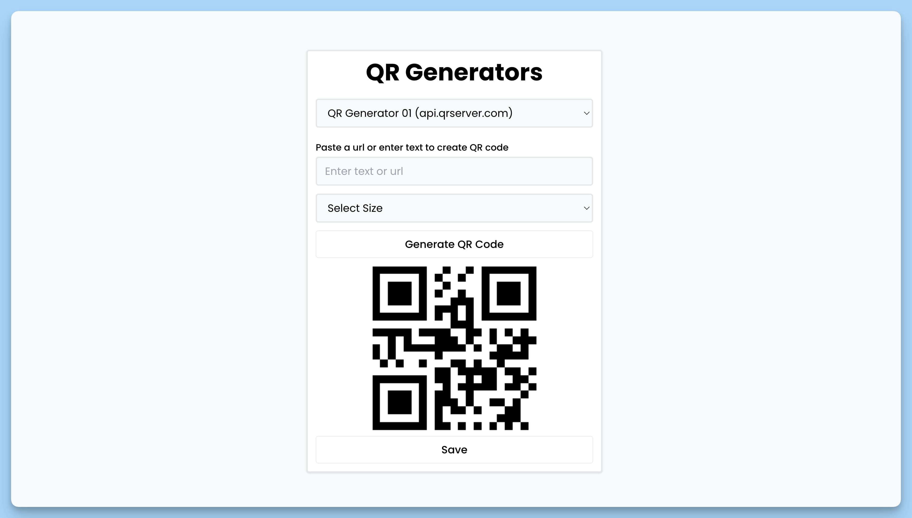

## 📦 qr-code generator app

### 🚀 overview
qr code generator react application. main component of the application that allows the user to choose different qr codes generators and create qr codes with different parameters.

### functionality

1. the user sees the name of the application "qr generators" and a falling list for choosing the type of qr code generator.
2. different generators are available in the list, each with a description.
3. when choosing a generator from the list, the corresponding component is displayed for creating a qr code.
4. the user can change the parameters of the qr code, such as text, size and color.
5. after setting up the parameters, the user can save the qr code for his device.
6. in the event of notifications (for example, an error), the `react-hot-toast` library is used to display them at the bottom of the screen.

### structure

- `app` is the main component of the application.
- `selected` - a condition that stores the selected type of generator.
- `onchange` - a function for processing changes in the drop -down list.
- qrcodegenerator01`, `qrcodegenerator02`, qrcodegenerator03`,` qrcodegenerator04`, qrcodegenerator05` - components for generating qr codes that are displayed depending on the choice of user.
- `toaster` is a component to manage notifications.

the application provides a simple method of generating qr code with different users.
---
#### 🌄 preview:

x